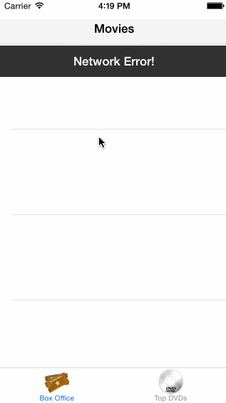

Rotten Tomatoes iOS Application
===============================

**Hours Worked**: 20 hours

Implemented Stories
-------------------
   * User can view a list of movies from Rotten Tomatoes.  Poster images must be loading asynchronously.
   * User can view movie details by tapping on a cell
   * User sees loading state while waiting for movies API.
   * User sees error message when there's a networking error using a custom label.
   * User can pull to refresh the movie list.
   * Add a tab bar for Box Office and DVD (optional).
   * All images fade in (optional).

Demo
----

